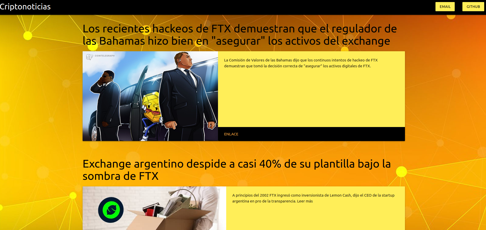

# App Flask Criptonoticias
###### App simple que muestra los últimos posts de algunos canales RSS de criptomonedas
### Deployed:
###### https://motecryptonews.herokuapp.com/

### Librerias usadas:
###### Flask
###### bs4
###### xmltodict
###### requests
###### random
### Canales RSS:
###### https://es.cointelegraph.com/rss
###### https://cointext.com/es/noticias/feed
###### https://www.criptonoticias.com/feed
